# EduApp
EduApp is a mini e-learning platform based on udemy's public api.
It has 4 main navigation destinations (Home, Search, Wishlist, Cart).
Users can search courses from different categories and get real-time results from the api using 
[Chips](https://material.io/components/chips/android) for a smooth filtering experience.
It has different theme for dark mode.
## Screens
- Home 
- All courses
- Search
- Wishlist
- Cart
- Course details

## Features
- Search courses
- Wishlist courses
- Cart logic
- Cache courses for offline better experience
- Dart mode support

## Tech
- [Navigation component](https://developer.android.com/guide/navigation?gclid=Cj0KCQjwmouZBhDSARIsALYcouoEzVh473bVV4ZKen9DrESxlnro7zH0Ue17y8ItumGVs558UFtPZLMaArvcEALw_wcB&gclsrc=aw.ds) - App navigation -> Single activity concept.
- [Safe Args](https://developer.android.com/guide/navigation/navigation-pass-data) - For type-safe passing objects between screens.
- [Dagger-Hilt](https://developer.android.com/training/dependency-injection/hilt-android) - For dependency injecetion.
- [Picasso](https://github.com/square/picasso) - Image loading.
- [Room](https://www.google.com/aclk?sa=l&ai=DChcSEwi9grKR_Zf6AhXL29UKHXDAAQEYABAAGgJ3cw&sig=AOD64_0mj-zhfeWtng8VaNttu5jtKW8Rrg&q&adurl&ved=2ahUKEwiCmauR_Zf6AhURGewKHVeZCdgQ0Qx6BAgEEAE) - Caching and saving wishlist & cart items.
- [Retrofit](https://square.github.io/retrofit/) - Network.
- [Gson](https://github.com/square/retrofit/tree/master/retrofit-converters/gson) - Serialization.
- [Kotlin coroutines](https://developer.android.com/kotlin/coroutines) - Concurrency.
- [Datastore](https://developer.android.com/topic/libraries/architecture/datastore?gclid=Cj0KCQjwmouZBhDSARIsALYcouqqVwqHCWPrxpL_ai4jk13C_i1-T3bVXUeBsp2L8bhfWAB5bKcHedcaApyDEALw_wcB&gclsrc=aw.ds) - Used for presisting filter values.
- [Livedata](https://developer.android.com/topic/libraries/architecture/livedata)
- [Viewmodel](https://developer.android.com/topic/libraries/architecture/viewmodel?gclid=Cj0KCQjwmouZBhDSARIsALYcouowU4bI_Dxt9XRlsd4-qAblwn2Vk3jgw86XJFJdhJuraSbTxzGNgwMaAvejEALw_wcB&gclsrc=aw.ds)
- [View Binding](https://developer.android.com/topic/libraries/view-binding)

### Todo
- [ ] Paging
## Screenshots
### Light theme
<kbd>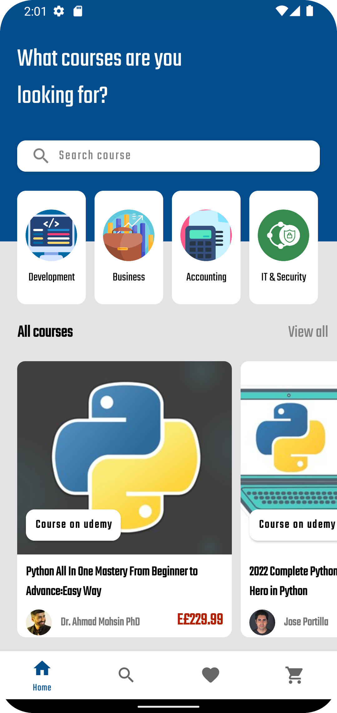</kbd>
<kbd>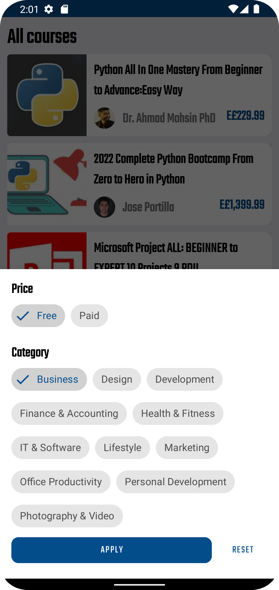</kbd>
<kbd>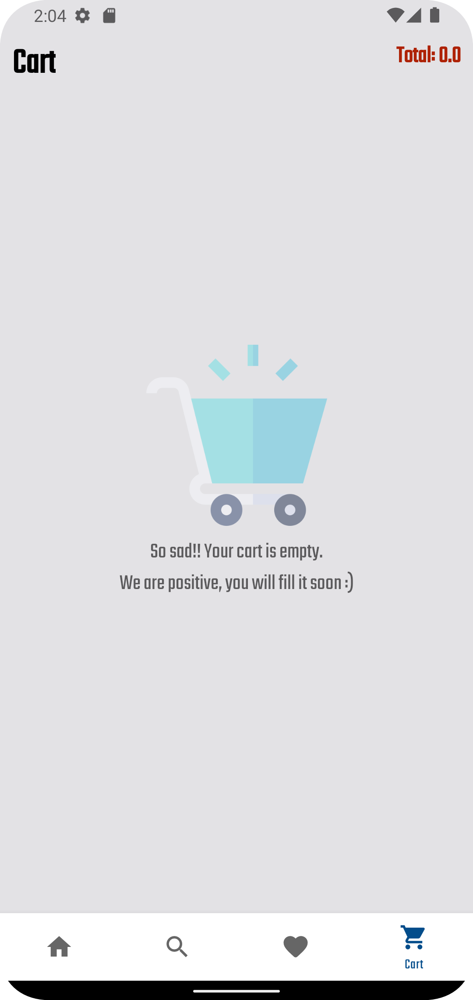</kbd>
<kbd>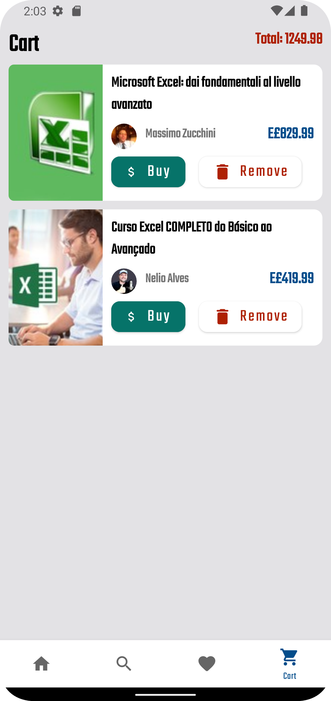</kbd>
<kbd></kbd>
<kbd>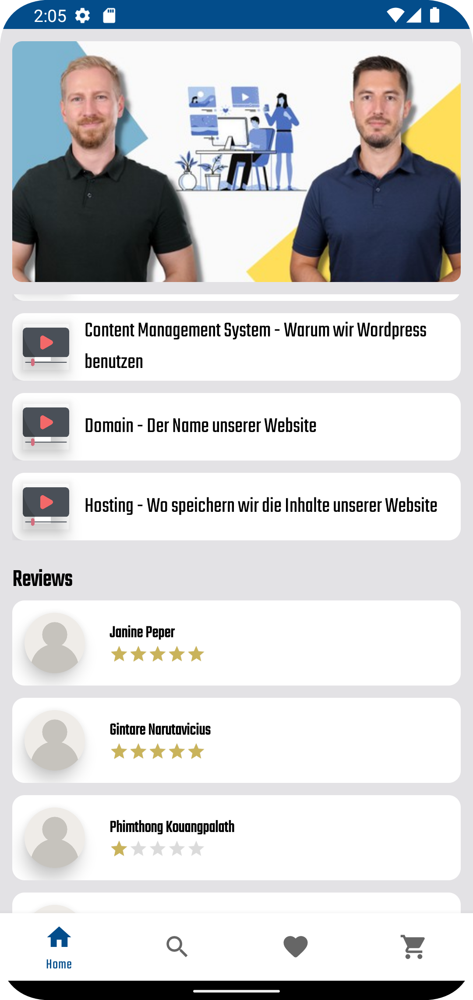</kbd>
<kbd>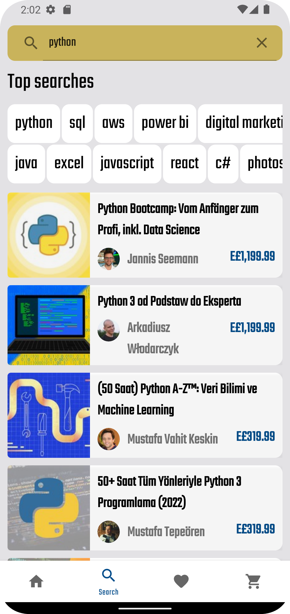</kbd>
<kbd>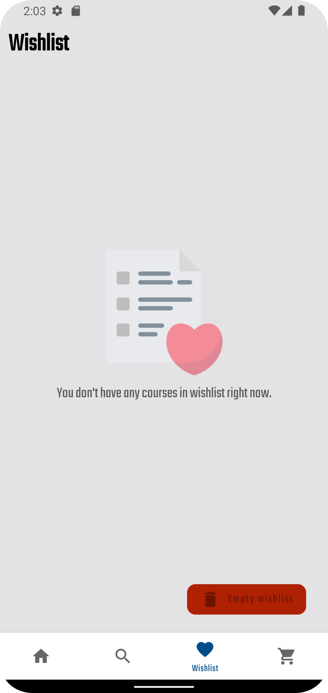</kbd>
<kbd>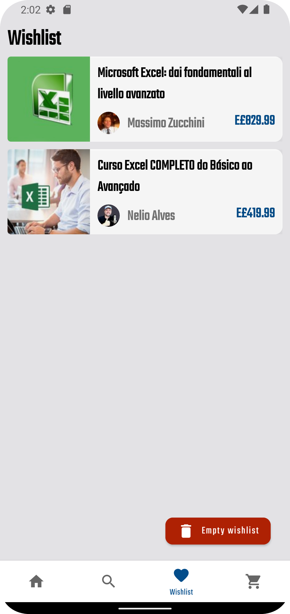</kbd>

### Dark theme
<kbd>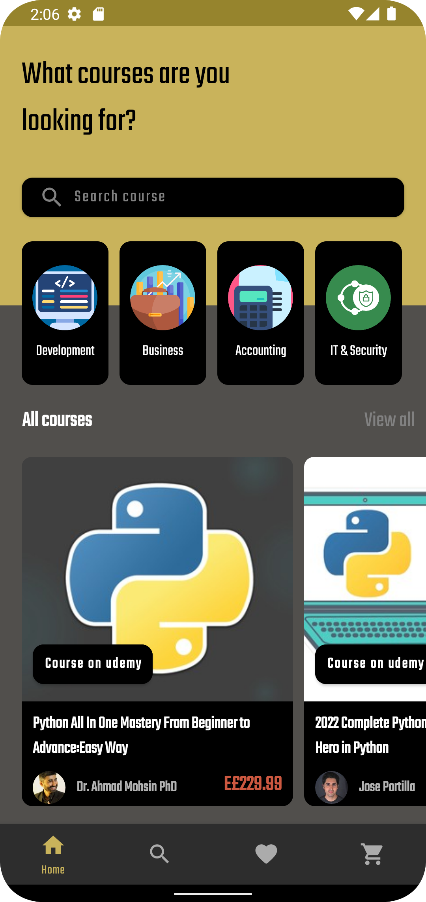</kbd>
<kbd>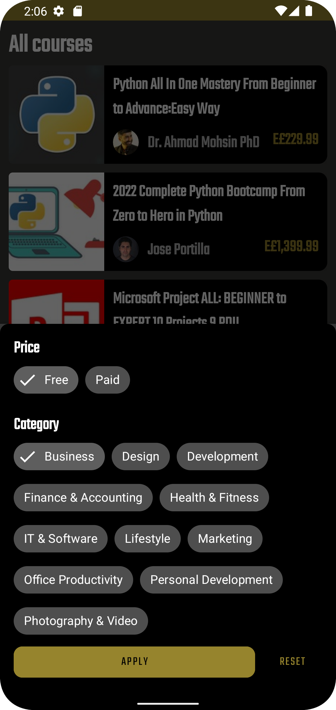</kbd>
<kbd>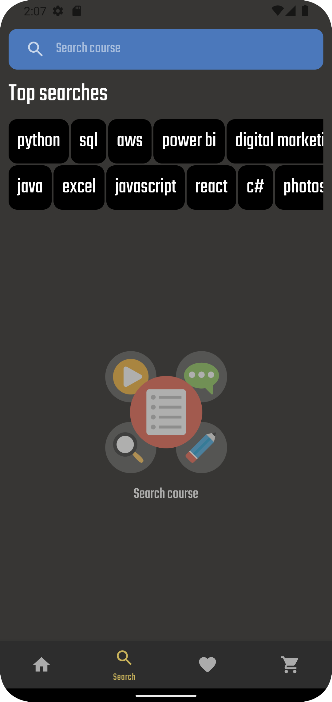</kbd>
<kbd>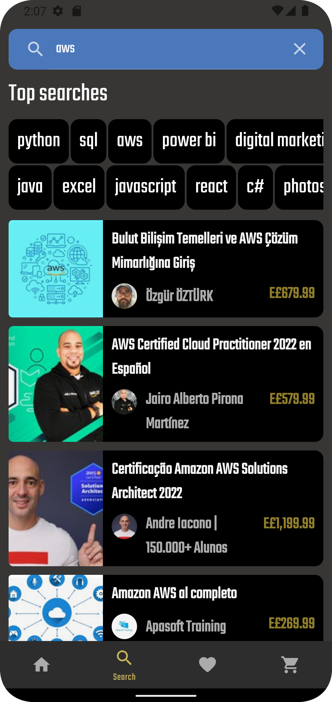</kbd>

<kbd></kbd>
<kbd>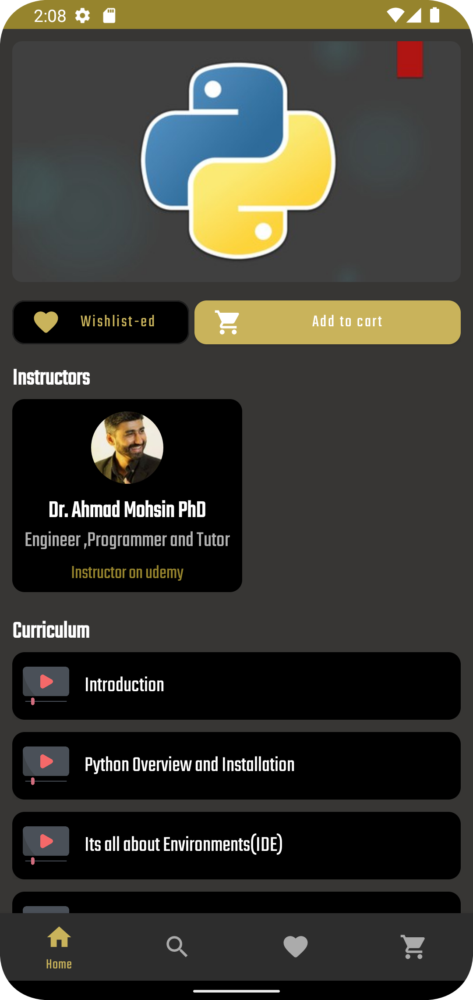</kbd>
<kbd>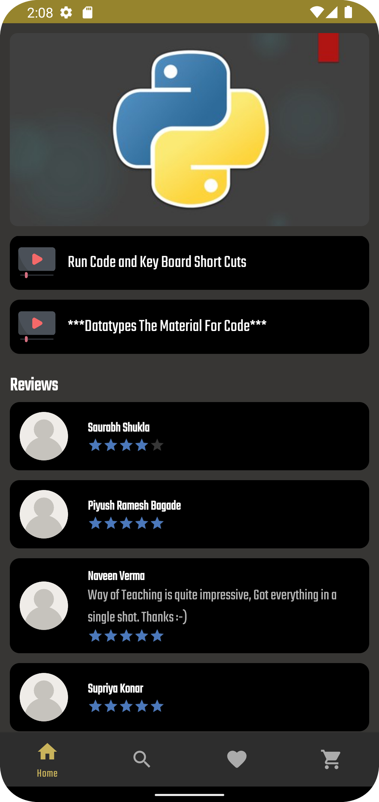</kbd>

<kbd>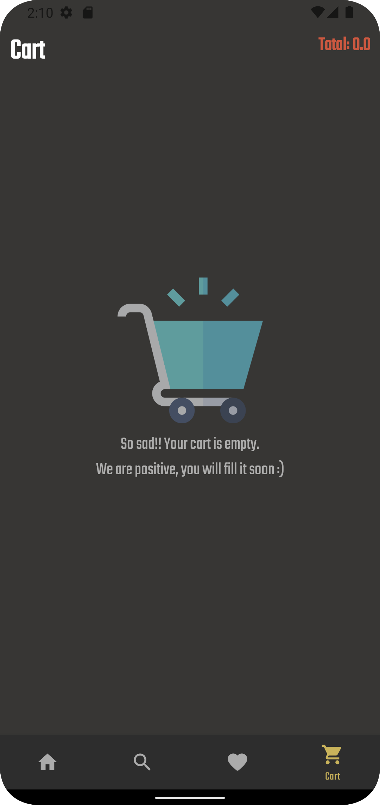</kbd>
<kbd>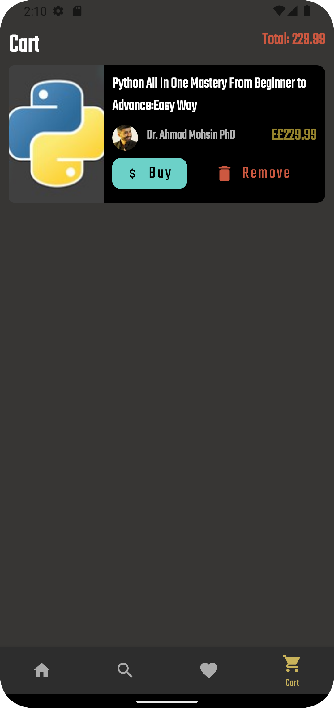</kbd>

<kbd>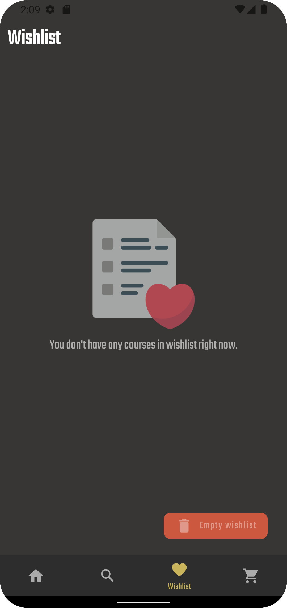</kbd>
<kbd>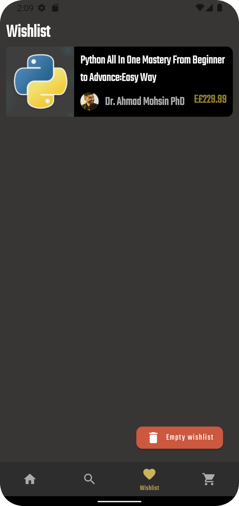</kbd>
<kbd>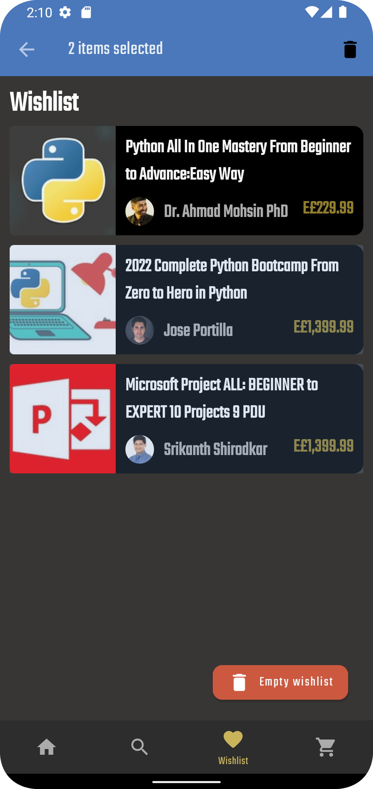</kbd>

